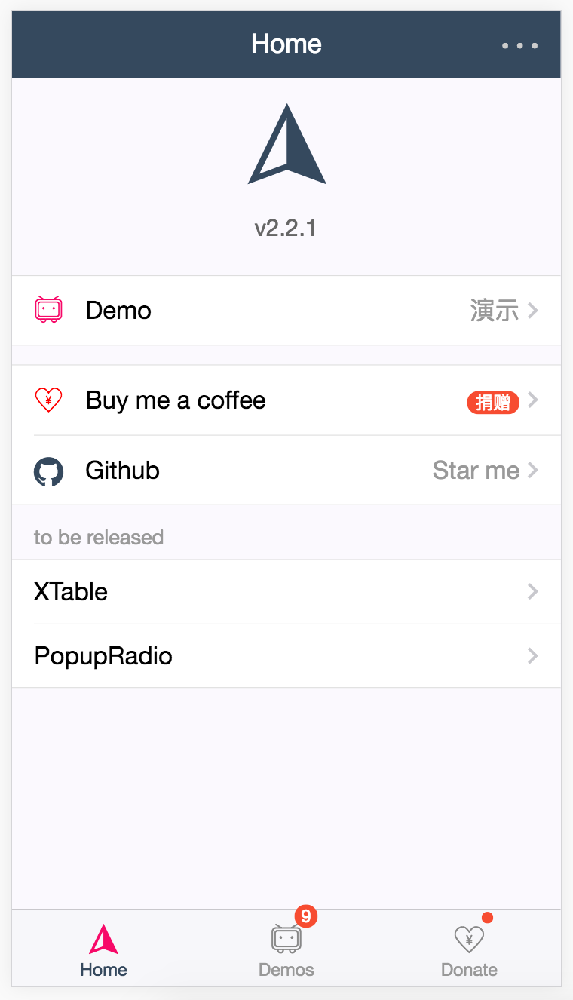
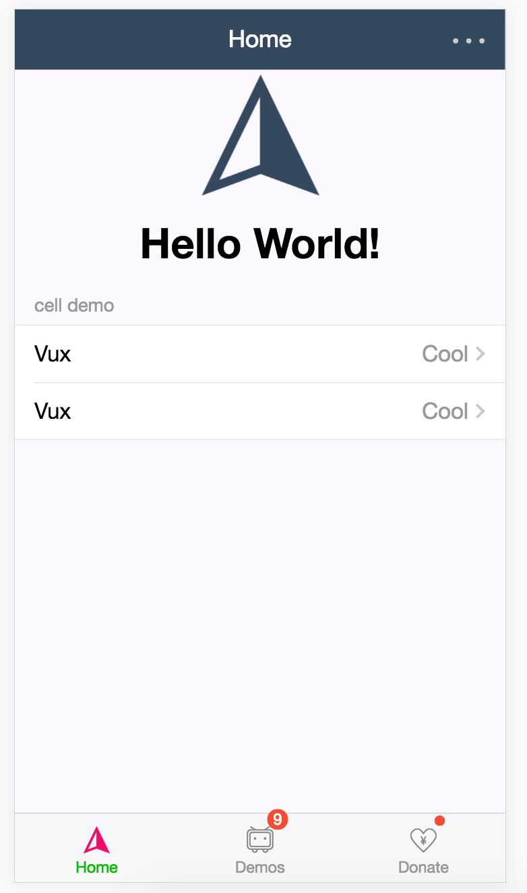

# vux starter
由于项目需要，基于vux进行微信端页面开发，所以我基于vux的demo布局，做了这么一个脚手架。

主要也是为了vux demo例子的布局，方便以后项目使用。

## vux demo

大概是这样子



具体可以直接访问 [vux demo](https://vux.li/demos/v2/?x-page=v2-doc-home#/)

## 启动

``` bash
# install dependencies
npm install

# serve with hot reload at localhost:8080
npm run dev

# build for production with minification
npm run build

# build for production and view the bundle analyzer report
npm run build --report

```

For detailed explanation on how things work, checkout the [guide](http://vuejs-templates.github.io/webpack/) and [docs for vue-loader](http://vuejs.github.io/vue-loader).


## 脚手架效果图
脚手架跑起来的布局



## 后续开发

后续开发基于[vux](https://vux.li/#/)文档，根据需求填充页面或者修改布局即可。
